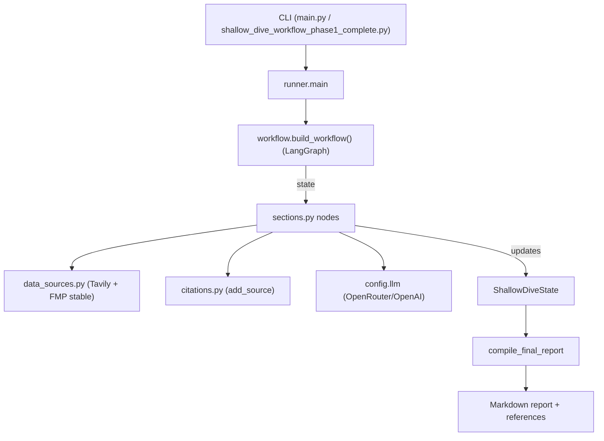

# Shallow Dive Workflow (Phase 1)

Automated equity research workflow that assembles a full “shallow dive” report (profile → thesis → industry → EVA → risks → valuation → engagement) using LangGraph, LLMs, web search, and finance APIs.

## Features
- 25-section workflow mapped to the knowledge-base prompts (1.1–8.4).
- LLM provider fallback: OpenRouter (preferred) or OpenAI.
- Web search via Tavily; optional Financial Modeling Prep/Alpha Vantage for fundamentals.
- Batch or single-company execution; outputs Markdown reports with citations.

## Setup
1) Install deps (editable for local dev):
- With `pip`:
```bash
pip install -e .
```
- Or with [`uv`](https://github.com/astral-sh/uv) (fast, from lockless pyproject):
```bash
uv sync --editable .
```
2) Copy the environment template and fill keys:
```bash
cp .env.example .env
```
Required: `TAVILY_API_KEY` and either `OPENROUTER_API_KEY` (preferred) or `OPENAI_API_KEY`. Optional: `FMP_API_KEY`, `ALPHA_VANTAGE_KEY`, model overrides (`OPENROUTER_MODEL`, `OPENAI_MODEL`), and `LOG_LEVEL`.

## Usage
Single company:
```bash
python3 shallow_dive_workflow_phase1_complete.py --company "Alibaba Group" --ticker "BABA" --output-dir ./reports
```

Batch (JSON file with `[{ "name": "...", "ticker": "..."}, ...]`):
```bash
python3 shallow_dive_workflow_phase1_complete.py --batch companies.json --output-dir ./reports
```

Outputs:
- Report: `shallow_dive_<TICKER>_<YYYYMMDD>.md` in `--output-dir`.
- Batch summary CSV when using `--batch`.

## Project Structure
- `shallow_dive/config.py` – env/config, LLM selection, logging, shared tools.
- `shallow_dive/state.py` – workflow state schema.
- `shallow_dive/data_sources.py` – Tavily search, FMP profile/metrics helpers.
- `shallow_dive/citations.py` – source tracking and references rendering.
- `shallow_dive/sections.py` – all section nodes (prompts/workflow logic).
- `shallow_dive/workflow.py` – LangGraph assembly/order.
- `shallow_dive/runner.py` – CLI entry, single/batch execution.
- `shallow_dive_workflow_phase1_complete.py` – thin entrypoint calling runner.

## Architecture (conceptual)
- CLI (`main.py`/`shallow_dive_workflow_phase1_complete.py`) parses args → `runner.main`.
- `runner` builds initial state → `workflow.build_workflow()` → LangGraph executes nodes in sequence.
- Nodes live in `sections.py`, each:
  - Pulls data/search via `data_sources.py` (Tavily + FMP stable endpoints).
  - Adds sources via `citations.add_source` (URL → citation number).
  - Prepares prompt context with numbered snippets → LLM call (`config.llm`, OpenRouter/OpenAI).
  - Writes section output back into state.
- `compile_final_report` stitches all section strings and references into Markdown.
- Logging (`config.logger`) wraps all steps; env/config and LLM selection in `config.py`.



## Notes
- Logging is controlled via `LOG_LEVEL` (default INFO) and emitted to stdout.
- OpenRouter is used when `OPENROUTER_API_KEY` is set; otherwise falls back to OpenAI.
- Reports include references with citation numbers derived from tracked sources.
